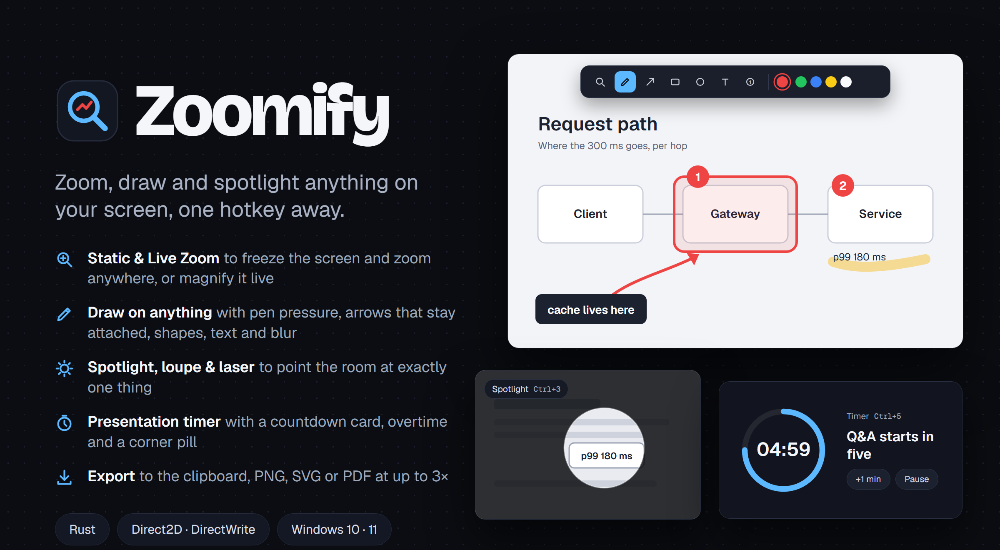
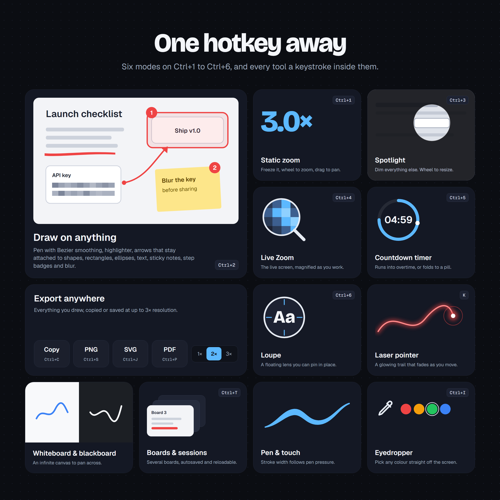

[](https://github.com/iolitetech/Zoomify/actions/workflows/ci.yml)
[](LICENSE)
[](https://crates.io/crates/zoomify)

# Zoomify

A screen overlay for presenting on Windows. Zoomify freezes and zooms the screen, lets you draw
on top of it, spotlights or magnifies one region, and runs a countdown timer, each from a global
hotkey. What you draw can be copied or saved as PNG, SVG or PDF.





## Features

**Modes** (default hotkeys, configurable in Settings)

| Hotkey | Mode |
|---|---|
| `Ctrl+1` | Static zoom: freeze the screen, wheel to zoom, drag to pan, draw on top |
| `Ctrl+2` | Draw mode |
| `Ctrl+3` | Spotlight: dim everything but a circle, wheel to resize |
| `Ctrl+4` | Live zoom: the live screen, magnified |
| `Ctrl+5` | Countdown timer, with overtime and a corner pill |
| `Ctrl+6` | Loupe: a floating lens, wheel to zoom, Space to pin |

**Drawing**
- Pen with Bezier smoothing and pen pressure, and a highlighter.
- Lines and arrows, which bow into curves and stay attached to the shapes they point at.
- Rectangles, rounded rectangles, ellipses, text, sticky notes, numbered step badges and a
  blur box for redacting.
- A laser pointer with a fading trail, and an eyedropper that picks colours off the screen.
- Select, move, resize, group, align and snap; undo and redo.
- Whiteboard and blackboard slates, an infinite canvas you can pan past the screen edge.

**Saving and sharing**
- Copy to the clipboard, save a PNG snapshot, or export SVG or PDF, at 1×, 2× or 3×.
- Paste images in from the clipboard.
- Several boards per session. Sessions autosave and can be reopened.

Press `F1` in any overlay mode for the full list of shortcuts.

## Install

Download `zoomify-windows-amd64.zip` from the
[releases page](https://github.com/iolitetech/Zoomify/releases) and run `zoomify.exe`. It sits
in the system tray. Or build it from source:

```
cargo install zoomify
```

Windows 10 or 11 only: Zoomify is built on Direct2D, DirectWrite and Windows Graphics Capture.
Building needs Rust 1.88 or newer.

## Development

```
cargo fmt --check
cargo clippy --all-targets -- -D warnings
cargo test
```

Releases are cut with the **Publish Release** workflow; see [CONTRIBUTING.md](CONTRIBUTING.md).

## License

MIT, see [LICENSE](LICENSE).
